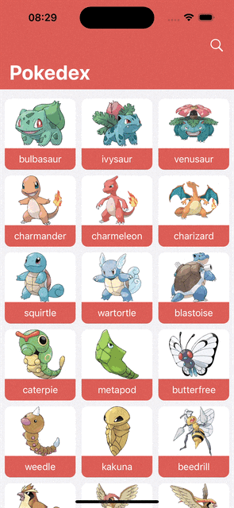
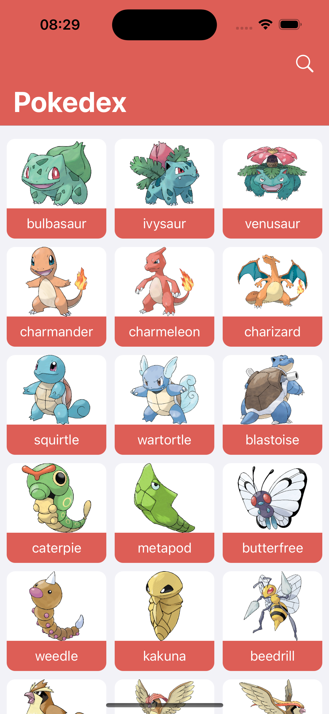
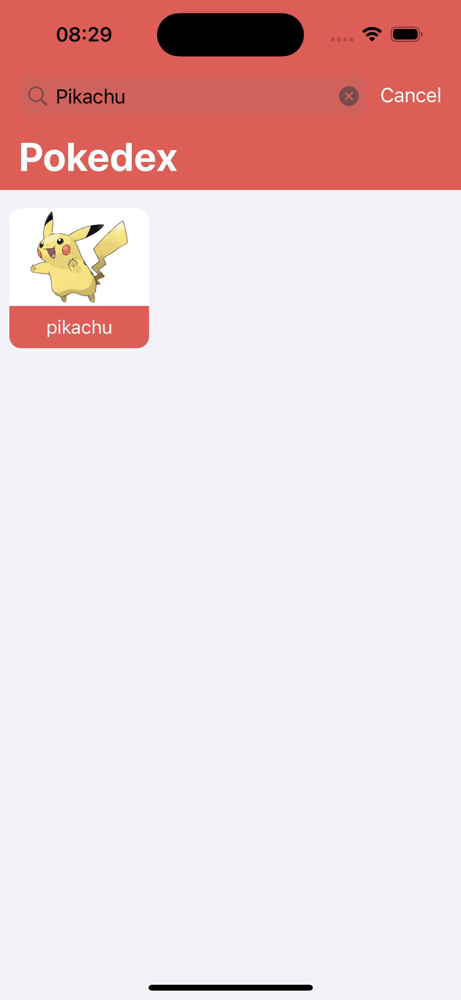
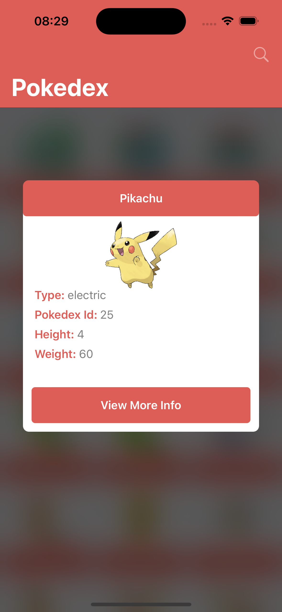
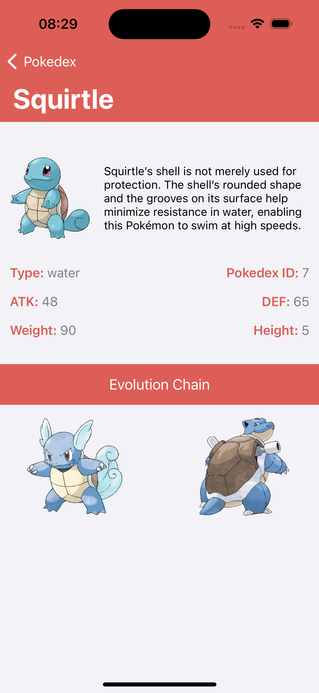

# Pokedex App

Pokedex learning app: an app to list pokemons on screen and a details page of each pokemon

### Preview 

### Features
- 150+ Pokemons from a Rest API
- Pokemon short details modal
- Pokemon full details screen
- Search Pokemons on home screen

### Made with
- ViewCode: interface and components
- UICollectionView, UICollectionViewCell
- Delegates Pattern, Protocol Patterns
- MVC Architecture
- NetworkService with URL Session
- UISearchBar
- Dark Mode support

### Screenshots

<table>
  <tbody>
   <tr>
      <td></td>
      <td></td>
      <td></td>
      <td></td>
    </tr>
  </tbody>
</table>
